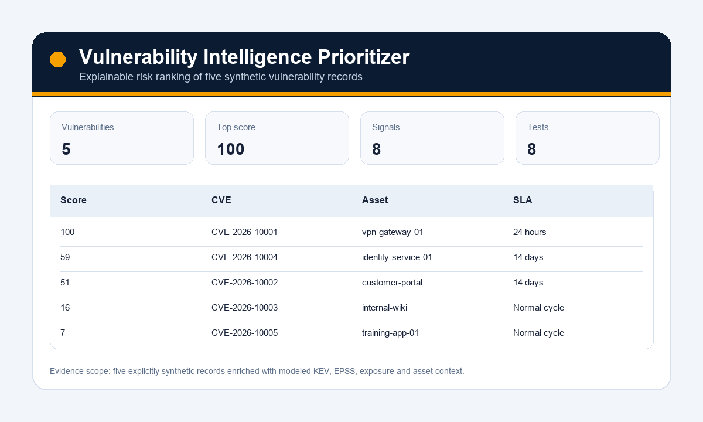

# Vulnerability Intelligence Prioritizer

  



## Employer Review

| Area | Evidence |
| --- | --- |
| Target role | Vulnerability Management / Security Operations |
| Strongest proof | CVE prioritisation logic, SLA assignment, screenshot preview, tests |
| Start here | [docs/screenshots/report-preview.png](docs/screenshots/report-preview.png) |
| Deeper review | [docs/employer-review.md](docs/employer-review.md) |
| Roadmap | [docs/roadmap.md](docs/roadmap.md) |
Vulnerability Intelligence Prioritizer ranks vulnerabilities by severity, known exploitation, internet exposure, and asset criticality. It turns a flat CVE list into an action plan.

## Why Employers Like This

Real security teams cannot patch everything instantly. They need risk-based prioritization. This project shows vulnerability management thinking, business context, and remediation SLAs.

## Features

- Loads vulnerability data from JSON.
- Combines CVSS, KEV/known exploitation, EPSS, public exploit availability, exposure, asset criticality, finding age, and compensating controls.
- Produces a priority score.
- Shows an explainable score breakdown and records the source of every input.
- Assigns remediation SLAs.
- Exports Markdown and machine-readable JSON reports.
- Includes tests and sample data.

## Example Report

See [docs/examples/example_vulnerability_priorities.md](docs/examples/example_vulnerability_priorities.md) for a rendered sample prioritization report.

## Active Roadmap

See [Roadmap](ROADMAP.md) for planned improvements and maintenance direction.

## Quick Start

```bash
set PYTHONPATH=src
python -m vuln_intel_prioritizer.cli
python -m unittest discover -s tests -v
```

## Skills Demonstrated

- Vulnerability management
- Risk scoring
- Asset criticality modeling
- KEV/EPSS enrichment modeling and compensating-control analysis
- Python data processing
- Security reporting

## Responsible Use

This tool supports defensive prioritization and does not scan or exploit systems.
